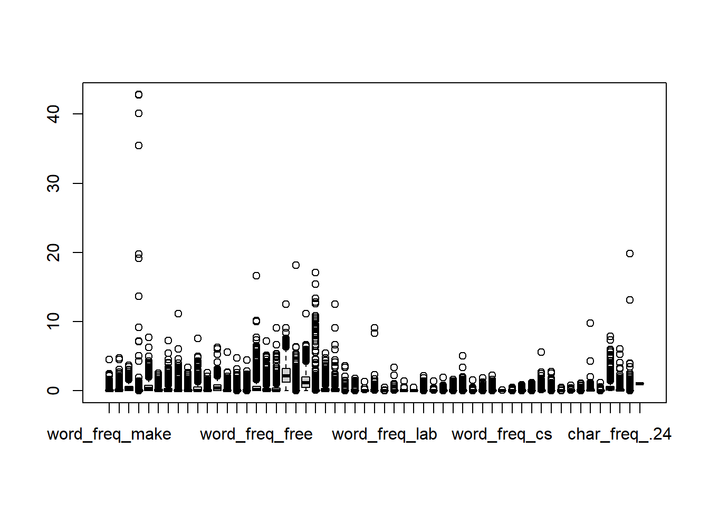
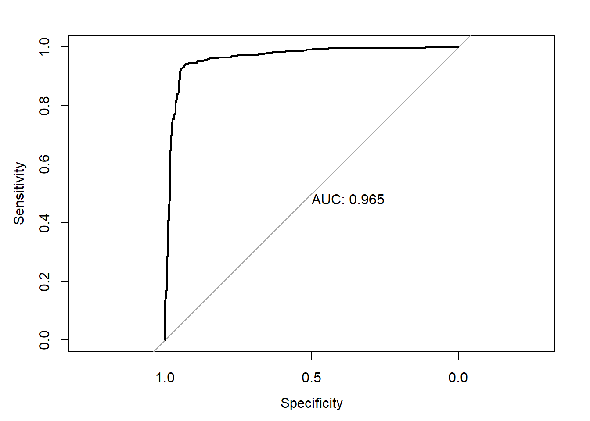
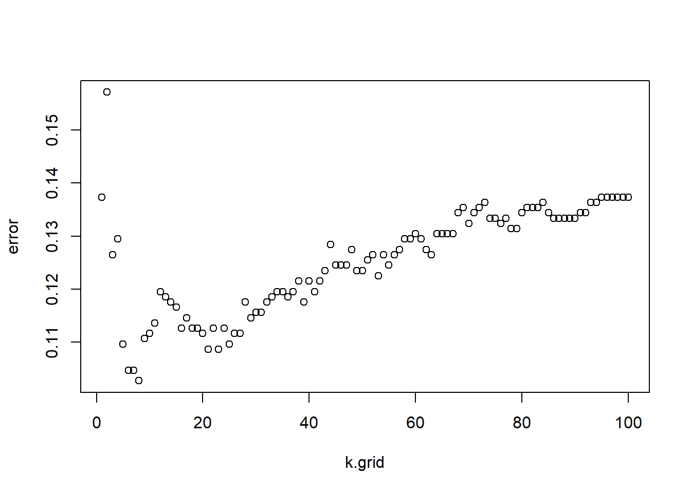

# **Spam Email Project**

Spam emails are a multifaceted problem with implications for individual privacy, organizational security, and the overall integrity of digital communication channels. Combating spam requires a combination of legal, technical, and educational approaches to minimize its impact and protect users from its associated risks. The primary goal of spam emails varies, ranging from advertising products or services to attempting to deceive recipients into revealing personal information, downloading harmful software, or parting with their money through scams.

# Dataset Description

In this dataset named "spambase_csv.csv", there are 55 columns and each column contains the metric of specific word percentage contained by the email. Words like "make", "won", "click" and "here" are examples. The column "class" is the response variable which provides the results either the email is spam or not.

#### Installing Libraries and Data loading

```{r}
#Installing Libraries and Data Loading 

library(tidyverse)
library(caret)
library(class)
library(nnet)
library(MASS)


spam_email <- read.csv("C:/Users/USNHIT/Desktop/Machine Learning Projects/Spam Email Project/spambase_csv.csv")
head(spam_email)

spam_email

```
#### Data Cleaning/Finding missing values

```{r}

#missing values
columns_with_missing_values <- spam_email%>%
  summarise(across(everything(),~sum(is.na(.)))) %>%
  pivot_longer(cols = everything(),names_to = "Column", values_to = "Missing_values")%>%
  filter(Missing_values>0)


```
0 missing value have been found; Dataset is already cleaned and maintained.

```{r}
#Exploratory Data Analysis 

#data distribution  
#1813 out of 4601 are spam emails  

spam_email%>%
  group_by(spam_email$class)%>%
  summarise(sum = sum(class))

#which set of words have highest proportion in spam email?


#proportion  <- spam_email%>%
  #filter(class == 1)%>%
  #select(-capital_run_length_average,-capital_run_length_longest,-capital_run_length_total)

#boxplot(proportion)

#max_values <- apply(proportion,2,max, na.rm=TRUE) #1 for rows & 2 for columns

#plot(max_values)  

```

<!-- -->
#### Test/Train Split

```{r}
# test train split

size_email = round(nrow(spam_email)*0.22)

testing = sample(nrow(spam_email),size_email)

train_spam =  spam_email[-testing,]
test_spam = spam_email[testing,]

```


#### Logisitic Regression

```{r}
# Logistic Regression 

log_spam <- glm(class ~.,train_spam, family = binomial)
summary(log_spam)$coef

log_prob <- predict(log_spam,newdata = test_spam, type = "response")

log_pred <- rep(0, nrow(test_spam))
log_pred[log_prob>=0.5] = 1
log_pred = as.factor(log_pred)

#941 values out of 1012 were predicted correctly which is not bad.

library(caret)

table(log_pred, True = test_spam[,"class"])

round(mean(log_pred!=test_spam[,"class"]),4) # error rate is 7% 


cm = confusionMatrix(log_pred, as.factor(test_spam$class))
# Accuracy  = 93%

cm$byClass

library(pROC)

roc.test = roc(test_spam$class~log_prob,plot = TRUE,print.auc = TRUE)


```
<!-- -->
```{r}
 True
log_pred   0   1
       0 590  43
       1  28 351
[1] 0.0702
         Sensitivity          Specificity       Pos Pred Value       Neg Pred Value 
           0.9546926            0.8908629            0.9320695            0.9261214 
           Precision               Recall                   F1           Prevalence 
           0.9320695            0.9546926            0.9432454            0.6106719 
      Detection Rate Detection Prevalence    Balanced Accuracy 
           0.5830040            0.6254941            0.9227778 

```

Logistic Regression has performed well, meaning this dataset is linearly separated and assumes no multicollinearity among variables. Another reason can be that the dataset is already well-maintained and cleaned. The ROC curve covers 96.5% of the area which is idealistic.

Further, I will test my dataset with various other algorithms to check whether my results are consistent or not. And, which model provides more optimal value.


#### Linear Discriminant Analysis

```{r}
# Linear Discriminant Analysis

library(MASS)

lda_m = lda(class~.,data = train_spam)


lda.predict = predict(lda_m,newdata = test_spam)

table(test_spam$class,lda.predict$class)

confusionMatrix(factor(test_spam$class), lda.predict$class)

```

```{r}
Reference
Prediction   0   1
         0 595  23
         1  81 313
                                          
               Accuracy : 0.8972          
                 95% CI : (0.8769, 0.9153)
    No Information Rate : 0.668           
    P-Value [Acc > NIR] : < 2.2e-16       
                                          
                  Kappa : 0.778           
                                          
 Mcnemar's Test P-Value : 2.28e-08        
                                          
            Sensitivity : 0.8802          
            Specificity : 0.9315          
         Pos Pred Value : 0.9628          
         Neg Pred Value : 0.7944          
             Prevalence : 0.6680          
         Detection Rate : 0.5879          
   Detection Prevalence : 0.6107          
      Balanced Accuracy : 0.9059          
                                          
       'Positive' Class : 0 

```
Linear discriminant analysis(LDA) has also performed very similar as logistic regression has performed. One of the reason can be that LDA finds a linear combination of features to separate classes and calculates the discriminant score based on means of variable and pooled covariance matrix of the variable.

Having False negative more than the False positive is a concerning point here as some of the emails which are not spam will be considered as spam and ultimately loss of priority emails can damage the productivity.


#### KNN (for K=3 and K=7)

```{r}
#KNN 

train_features <- train_spam[, -ncol(train_spam)]
train_labels <- train_spam[, ncol(train_spam)]
test_features <- test_spam[, -ncol(test_spam)]
test_labels <- test_spam[, ncol(test_spam)]

knn3 = knn(train = train_features, test = test_features, cl = train_labels, k=3)

table(knn3, (test_labels))

mean(knn3 ==test_labels)
 


knn7 = knn(train = train_features, test= test_features, cl = train_labels, k =7)

table(knn7,test_labels)
mean(knn7 ==test_labels)

```
```{r}
knn3   0   1
   0 519  99
   1  99 295
[1] 0.8043478
    test_labels
knn7   0   1
   0 524  96
   1  94 298
[1] 0.812253

```
In the KNN algorithms, the test accuracy results have been decreased to approximately 80%. One of the reason of the loosing the accuracy is that our data is high dimensional data as our dataset contains 55 variables.


#### Choosing best k value for the algorithm

```{r}

# choosing best k value for knn

set.seed(122)
k.grid= 1:100
error = rep(0, length(k.grid))

for (i in seq_along(k.grid)) {
  pred = knn(train = scale(train_features), 
             test = scale(test_features),
             cl = train_labels,
             k = k.grid[i])
  error[i] = mean(test_labels!= pred)
  
}

min(error)

plot(k.grid,error)

```
<!-- -->

In the next step of KNN, I tried to find the best KNN value to get lowest error rate. In the graph as we can see that along with increase of k value, the error rate is also increasing.


#### Boosting

```{r}
library(gbm)
set.seed(123)
model.spam <- gbm(formula = class ~ ., distribution="bernoulli", data=train_spam, n.trees = 10000)
print(model.spam)

pred.spam=predict(model.spam, newdata=test_spam,n.trees=10000, distribution="bernoulli", type="response")
spampred=ifelse(pred.spam < 0.5, 0, 1)

confusionMatrix(factor(test_spam[,"class"]), factor(spampred))
```

```{r}
Reference
Prediction   0   1
         0 594  24
         1  36 358
                                          
               Accuracy : 0.9407          
                 95% CI : (0.9243, 0.9545)
    No Information Rate : 0.6225          
    P-Value [Acc > NIR] : <2e-16          
                                          
                  Kappa : 0.8746          
                                          
 Mcnemar's Test P-Value : 0.1556          
                                          
            Sensitivity : 0.9429          
            Specificity : 0.9372          
         Pos Pred Value : 0.9612          
         Neg Pred Value : 0.9086          
             Prevalence : 0.6225          
         Detection Rate : 0.5870          
   Detection Prevalence : 0.6107          
      Balanced Accuracy : 0.9400  

```

#### Support Vector Machines 

```{r}
library(e1071)

svm_model<- svm(class ~ ., data = train_spam, type = "C-classification", kernel = "linear", scale = FALSE, cost=0.1)

svm_model

pred_test <- predict(svm_model, test_spam)
mean(pred_test == test_spam$class)

confusionMatrix(pred_test, factor(test_spam$class) )

```

```{r}
Number of Support Vectors:  804

[1] 0.9219368
Confusion Matrix and Statistics

          Reference
Prediction   0   1
         0 559  20
         1  59 374
                                          
               Accuracy : 0.9219          
                 95% CI : (0.9037, 0.9377)
    No Information Rate : 0.6107          
    P-Value [Acc > NIR] : < 2.2e-16       
                                          
                  Kappa : 0.8387          
                                          
 Mcnemar's Test P-Value : 1.909e-05       
                                          
            Sensitivity : 0.9045          
            Specificity : 0.9492          
         Pos Pred Value : 0.9655          
         Neg Pred Value : 0.8637          
             Prevalence : 0.6107          
         Detection Rate : 0.5524          
   Detection Prevalence : 0.5721          
      Balanced Accuracy : 0.9269          
                                          
       'Positive' Class : 0       

```
Boosting and Support Vector Classifier, both have performed well as they handle high dimensional data very well. Specifically for Support Vector Machines, false negative is higher as compared to false positive which still remains the same issue of neglecting the legitimate emails which are not spam.

## Conclusion

In conclusion, boosting and logistic regression have performed well in terms of our criteria set. Hence to further optimize, we can use XG Boost or perform cross-validation to tune the model. Otherwise, our all models have performed better than expected. Even without tuning, our machine-learning model is set to be deployed.
